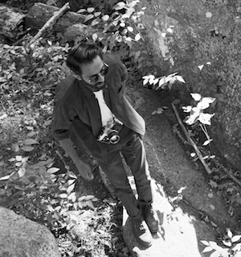

# SFPC Spring 2014 Participants

We are incredibly excited about this two week program! We have participants coming from as far as Japan, Korea, Thailand, and Australia with diverse experiences as artists, programmers, designers, curators, photographers, poets, interaction designers, architects and researchers.

## [**Alex Zandi**](http://alexzandi.com) (New York, USA)

Alex Zandi is an artist and designer whose work examines cybernetic structures and the chimeras that underpin the architecture of these systems. Utilizing language from experimental video, design, and modernist literature, Alex assembles a poetic that reframes the ever-evolving intersection between technology and media. Alex studied Communication Design and English Literature at Washington University in St. Louis. He currently lives and works in Brooklyn, New York.

---

## [**Alexander Porter**](http://alexanderporter.net) (New York, USA)

Alexander Porter is an experimental photographer exploring visual documentation. He brings a persistent admiration for photographic traditions and history to new imaging techniques. He is a part of the team behind the DepthKit (formerly RGBDToolkit), a hybrid process for creating cinematic imagery with commercially available depth sensors. His current interest is in understanding the impacts of computational photography on our world and repurposing esoteric scanning techniques for public use.

---

## [**Daniel Wilson**](http://danieljwilson.com) (New York, USA)

Daniel J Wilson is an artist and filmmaker working across multiple media. His work has been exhibited internationally, including Bunkier Sztuki in Krakow, Broadway Media Center in Nottingham, The European Independent Film Festival in Paris, culturaDigital in Rio de Janeiro, the Copenhagen Art Festival, the DUMBO Arts Festival and MoMA PS1 in New York. His work has been supported by the Ontario Arts Council, the National Film Board of Canada, Grand NCE and the Canada Council for the Arts.

---

## [**Diana Sánchez Barrios**](http://issuu.com/dianasanchezbarrios/docs/portfolio_dianasanchezb__1_) (Bogota, Colombia)

Designer from Bogotá-Colombia,interested in the dialogue between art and science,focus her work in exploring the use of technology to understand things like human perception. She seeks to explore sound, haptical interactions and biodesign, finding everything related to the human body inspiring.For her,design is a catalyzer,something that facilitate encounters between apparently unconnected things.She specializes in the invisible.Apprentice magician with emphasis on binary poetry frozen in orbit

---

## [**Hiroaki Yamane**](http://mnmly.com) (Oregon, USA)

Born in Kyoto, Hiroaki Yamane is a web developer who loves to work with designers to make beautiful things together. After graduation, he flew to Chicago to work at SimpleScott as developer. He learned the importance of typography, attention to detail and delightful interaction through various projects. Currently in Portland at AKQA making digital prototypes as a bridge between dev and creative. The ever growing desire to put what he has learned on the web onto hardware brought him to SFPC :)

---

## [**Hyojung SEO**](http://untitled5.com) (Seoul, South Korea)

Hyojung is a Seoul-based media artist working in interactive media. Her works were shown in many exhibitions like SIGGRAPH, Asia Triennial Manchester, Oogaki Biennale, Kobe Biennale. She had joined the international project ‘accented body’ with QUT to make a networked performance linking UK, Australia and Korea. Besides her non-commissioned work, she made interactive installations for major brand like Nike, SHISEIDO, Peugueot and so on; she teaches at the Samsung Art and Design Institute.

---

## [**Ida Benedetto**](http://uncommonplaces.com/) (New York, USA)

Ida Benedetto is a Brooklyn-based media strategist and experience designer. She believes in storytelling, empathy, and adventure. Ida co-founded Wanderlust Projects. Wanderlust makes experiences in places you aren’t supposed to be, with a focus on the transformative power of intimacy, transgression, location, and generosity. Her work has been praised in The New Yorker, The Atlantic, and O Estado de S. Paulo.

---

## [**Lee Tusman**](http://leetusman.com) (Pennsylvania, USA)

Lee Tusman is an artist and curator creating projects combining contemporary visual arts and internet media in democratic ways. Tusman has curated dozens of exhibitions and public projects for a diverse group of universities, galleries, institutions, alternative spaces and public interventions as well as in abandoned buildings, vehicles, gas stations, and elevators. He is Creative Director of The Hacktory, and Hidden City Philadelphia, and a curator at Litle Berlin gallery in Philadelphia.

---

## [**Nathan Koch**](http://nathankoch.com) (Illinois, USA)

Nathan Koch is a coder, electronic music producer, and live visualist from Chicago. He spends his days as a creative technologist at Cramer-Krasselt, an independent ad agency based in Chicago, but most nights end with him surrounded by drum machines in a darkened room. He's currently exploring using the Raspberry Pi in conjunction with a collection of old and new sequencers and drum machines to make an entirely live audiovisual performance without relying on a traditional laptop.

---

## [**Oscar Schwartz**](http://scarschwartz.com) (Victoria, Australia)

Oscar Schwartz is a writer from Melbourne, Australia. He is currently writing a PhD looking at whether computers can write poetry, and if so, what that means for humans poets. You can read his writing at: www.computerlit.tumblr.com.

---

## [**Ryota Okawa**](http://bubuportfolio.wix.com/portfolio/) (Kanagawa, Japan)

Ryota Okawa studies products designing and creative coding at Keio University in Japan. He makes things with laser cutter and other fabrication tools. Also he creates things with creative coding. He is interested in interaction of people and things including environments. In School for Poetic Computation, he works on finding a new way of visualizing things we cannot be aware of. He thinks that the world can be more real when we grasp what is happening behind.

---

## [**Scott Leinweber**](http://scottleinweber.com/) (New York, USA)

Scott is an architectural designer exploring the perceptual digital-physical overlap of spaces today. Coming from an architectural background, his experience is rooted in parametric and computational design, digital fabrication, and building information modeling. With this digital craft knowledge, he seeks out interactive artists and physical computing projects to probe our digital relationships with physical space. scottleinweber.com

---

## [**Shobun Baile**](http://shobunbaile.com/portfolio) (New York, USA)

Shobun is a New York-based multidisciplinary artist whose current work deals with the role labor and gender play in new materialisms. He also works collaboratively with artist Brett Renfer. Their work explores interactive ways to make large-scale phenomenon more accessible to human senses. Shobun received his BS in Russian Lit. and Molecular Biology from the Univ. of Michigan. He works in virology research at Columbia University, and is an assistant editor at the film journal 'Framework.'

---

## [**Tharit Tothong**](http://firmread.com) (New York, USA)

Firm Reed Tothong (firmread.com) is a Bangkok-born interdisciplinary artist, technologist, and game designer, with a background in architecture. He's dedicated to exploring politics in play, new interfaces for expression, and opensource education. His works had featured in Venice Biennale of Architecture 2010 and Maker Faire 2013. Currently, he is working on his indie game project, and co-running openFrameworks workshop meetup in NYC. He loves coding, walking, and strumming guitar.

---

## [**Zak Greene**](http://zakgreene.com) (New York, USA)

Zak Greene is a designer and developer based in Brooklyn. Born and raised in Detroit, he has a fondness for stories and ideas from the margins of society, an interest in finding new ways to tell them. He has worked on print publications born out of Occupy Wall Street, including the Occupied Wall Street Journal and Tidal, and currently works with Strike Debt! on web projects. Previously he's worked with C&G Partners on interactive exhibits, and studied at Rhode Island School of Design.

---
